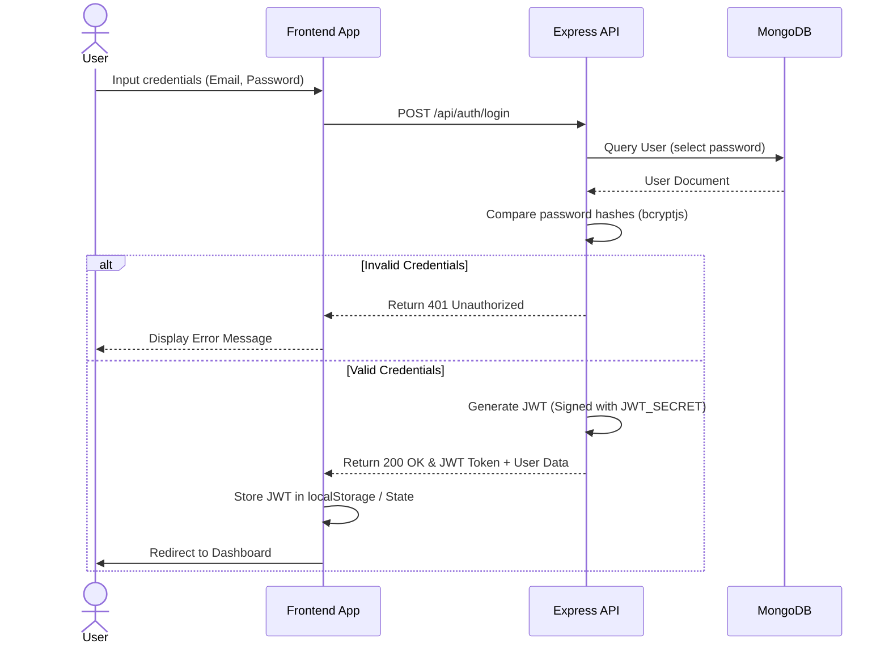
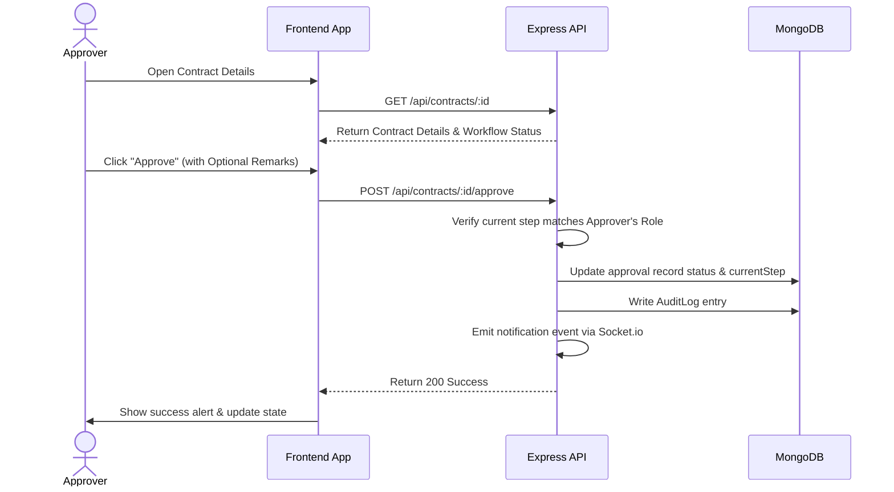
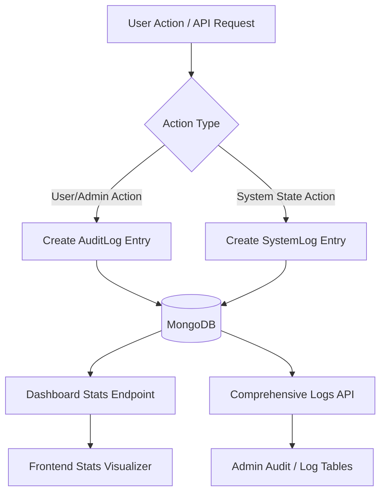
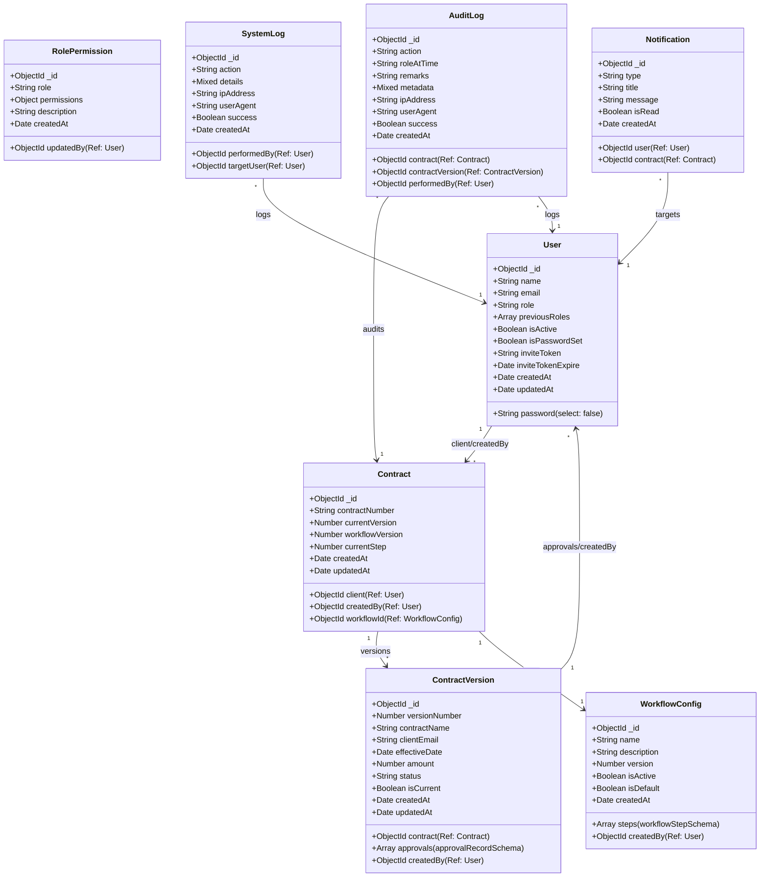

# Lynko — Contract Lifecycle & Workflow Management System

[](https://opensource.org/licenses/ISC)
[](https://react.dev/)
[](https://expressjs.com/)
[](https://www.mongodb.com/)

An enterprise-grade, secure Contract Lifecycle Management (CLM) system designed to automate, streamline, and govern contract preparation, dynamic approvals, audit tracking, and role-based notifications. 

---

## Project Description

**Lynko** (built on the *Signora* core framework) is a comprehensive Contract Lifecycle Management platform. It empowers enterprises to transition away from manual, email-based contract processing to a fully audited, automated workflow engine. Lynko ensures document compliance, provides granular permission controls, and maintains a strict append-only audit trail of every single contract action, revision, and approval step.

### Problem Statement
In traditional business environments, contract reviews and approvals are highly fragmented. Documents are sent over emails, leading to:
* **Version Control Chaos**: Multiple draft versions stored across different systems with no clear single source of truth.
* **Compliance Risks**: Approvals obtained verbally or via informal channels, leaving no legally binding or auditable record.
* **Bottlenecks & Delays**: No automated workflow routing; contracts stall because they are waiting on a stakeholder who is unaware of their pending action.
* **Lack of Access Control**: Insecure distribution of sensitive financial or legal terms to unauthorized personnel.

### Why Lynko Was Built
Lynko was engineered to centralize the contract lifecycle into a secure, event-driven web application. It introduces:
1. **Dynamic Approval Pipelines**: Custom-tailored steps based on organization structures.
2. **Immutable Versioning**: Clear demarcation of draft, review, active, and rejected states.
3. **Rigorous Compliance**: Cryptographically verified passwords, tokenized invites, and immutable audit logs that cannot be modified or deleted, satisfying internal compliance and external legal standards.

---

## Features

### Mandatory Features
* **Authentication**: Token-based authentication using JSON Web Tokens (JWT) with secure password hashing (bcryptjs) and password reset mechanisms.
* **Protected Routes**: Middleware-enforced API routes and Client-Side Router guards preventing unauthorized route transitions.
* **Contract Lifecycle Management**: Standardized generation, submission, review, approval, rejection, and amendment workflows.
* **Dynamic Workflow Routing**: Route contracts automatically through custom multi-stage approval lists based on locked workflows.
* **Real-time Notifications**: Notify users instantly of submission, approval, rejection, or amendment requests via Socket.io.
* **User Dashboard**: Role-customized statistics displaying pending approvals, active contracts, recent system activities, and user metrics.
* **Audit Trail**: Every action (created, viewed, approved, rejected, amended) is logged to an immutable log collection.
* **Responsive UI**: Sleek dashboard layout built with React, TailwindCSS, and Framer Motion, optimized for mobile, tablet, and desktop views.

### Bonus Features
* **Custom Roles**: Define and manage bespoke organizational roles (e.g., Risk Manager, Legal Head) dynamically.
* **Dynamic Permission Matrix**: Fine-tune specific abilities (e.g., `canEditDraft`, `canApproveContract`, `canViewAuditLogs`) on a per-role basis without touching code.
* **Immutable Workflows**: Prevent tampering of configured pipelines by locking workflow rules when a contract is created. Workflows are version-controlled and read-only once saved.
* **Real-time Activity Feed**: Live streaming of audit logs directly to the administrator dashboard.
* **System Health and Diagnostics Logs**: Dedicated administrative views for detailed backend logs and diagnostics.
* **Secure Invite System**: Admin-only user generation. Users are invited via secure, time-limited token links to set their own passwords.
* **Smart Progress Trackers**: Visual step-by-step progress charts for contracts undergoing multi-stage approvals.

---

## Tech Stack

| Layer | Technology | Version / Specification |
| :--- | :--- | :--- |
| **Frontend** | React, Vite (rolldown-vite), TailwindCSS, Framer Motion (motion) | React 19, ES Modules |
| **Backend** | Node.js, Express.js | Express 5.x, CommonJS |
| **Database** | MongoDB, Mongoose | Mongoose 9.x (Object modeling, compound indexing) |
| **Authentication** | JWT (jsonwebtoken), Bcryptjs | HS256 algorithm, 10-rounds salt hashing |
| **Notifications** | Socket.io, Nodemailer | Real-time WebSockets, SMTP Email integration |

---

## Architecture Overview

### Frontend Architecture
Built on **React 19** using **Vite** for optimized development HMR and builds. It uses React Router Dom for protected route routing. Universal client-side state is handled via React Context (e.g., AuthContext, NotificationContext) and styled using TailwindCSS for UI consistency. API interactions are managed using Axios clients with authorization interceptors.

### Backend Architecture
An Express server using a MVC-inspired router-controller-model layout. Request parameters are checked via `express-validator`. Security middleware (CORS, JWT validation, custom permission checker) guard routes. Real-time updates utilize WebSockets (via Socket.io) hooked directly into the server execution cycle.

### Database Design
MongoDB is utilized as the document database. Data integrity is enforced via Mongoose schemas. Models implement validation, automatic timestamps, and index specifications to speed up queries. Deletes and updates are restricted on logs and workflow configurations.

### Authentication Flow


### Redirect & Approval Flow


### Analytics & Logs Flow


---

## Database Schema



### Schema Descriptions & Relationships
* **User**: Manages system users. Integrates roles, previous changes history, and security verification tokens.
* **Contract**: Represents the top-level contract tracking record. Establishes links to the active client and the workflow definition rules locked at creation.
* **ContractVersion**: Tracks the document metadata, financial records, dynamic status, and workflow approval progression array. Many-to-one relationship with `Contract`.
* **WorkflowConfig**: Defines sequential step orders, role associations, and allowed skip commands. Immutable structure.
* **RolePermission**: Stores permissions for custom and default roles. Contains boolean mappings for access policies.
* **AuditLog**: Immutable append-only record tracking contract-related mutations. Has indexed links to contracts, versions, and active operators.
* **SystemLog**: Immutable tracker logging security/auth, administrative actions, and permission alterations.
* **Notification**: Direct messages sent dynamically or via sockets to specific users alerting them of pending workflow phases.

---

## Folder Structure

```
Signora/
├── backend/
│   ├── src/
│   │   ├── config/              # MongoDB and environment initializers
│   │   ├── controllers/         # Authentication, Admin, Contracts, Dashboard, Notifications, Users
│   │   ├── middleware/          # JWT protection, permission checking, validators, error handlers
│   │   ├── models/              # Mongoose schema definitions
│   │   ├── routes/              # Route setups (Auth, Admin, Contracts, Dashboard, Notifications, Users)
│   │   ├── utils/               # Emailer helper functions
│   │   ├── seed.js              # Database seeding script for default workflows and admin
│   │   └── server.js            # Express application bootstrapping & socket bindings
│   ├── .env                     # Local environment variables configuration file
│   ├── package.json             # Backend script commands and node dependencies
│   └── package-lock.json
└── frontend/
    ├── src/
    │   ├── assets/              # SVG logos, assets, custom icons
    │   ├── components/          # Shared components (Sidebar, Navbar, StatsCards, Loader, etc.)
    │   ├── context/             # Global Contexts (AuthContext, NotificationContext)
    │   ├── pages/               # Page Views (Dashboard, AuditTrail, Details, Roles, Lists, Logs, Users, etc.)
    │   ├── services/            # Axios API hooks and wrappers
    │   ├── utils/               # DateTime converters and status formatter functions
    │   ├── App.css              # Custom styling definitions
    │   ├── App.jsx              # Application router wrappers and routing mappings
    │   ├── index.css            # Base Tailwind and general theme configurations
    │   └── main.jsx             # React DOM renderer setup
    ├── .env                     # Frontend environment variables configuration file
    ├── tailwind.config.js       # Theme and layout specifications
    └── package.json             # Client-side configuration and build scripts
```

---

## Environment Variables

### Frontend Variables
Create a file named `.env` inside the `frontend/` directory:
```bash
# Target address of the Backend server API routing endpoint
VITE_API_URL=http://localhost:5000/api
```

### Backend Variables
Create a file named `.env` inside the `backend/` directory:
```env
PORT=5000

# Connection endpoint for local or cluster-based MongoDB database
MONGODB_URI=mongodb://localhost:27017/signora_test

# Secret salt key used for symmetric cryptographical validation of JWTs
JWT_SECRET=your-super-secret-jwt-key-change-in-production

# Valid period duration constraint for generated Auth tokens
JWT_EXPIRE=7d

# Target client hosting path used to generate user invitation redirects
FRONTEND_URL=http://localhost:5173

# Outbound Mail configurations (using standard SMTP transport services)
SMTP_HOST=smtp.gmail.com
SMTP_PORT=587
SMTP_SECURE=false
SMTP_USER=your_email@gmail.com
SMTP_PASS=your_gmail_app_password

# Notification sender information config
FROM_NAME=Lynko Contract System
FROM_EMAIL=your_email@gmail.com
ADMIN_EMAIL=your_email@gmail.com
```

---

## Local Development Setup

### Prerequisites
* **Node.js**: `v18.x` or later installed on your workstation.
* **MongoDB**: Locally running community server instance (`localhost:27017`) or a Mongo Atlas cloud cluster connection URI.

---

### Installation & Execution Setup

#### 1. Setup the Database & Backend
First, navigate into the backend directory:
```powershell
cd backend
```
Install all npm packages:
```powershell
npm install
```
Seed the database with default workflows, admin roles, and default superadmin login credentials:
```powershell
npm run seed
```
Start the development server with live reload:
```powershell
npm run dev
```

#### 2. Setup the Frontend
Open a new terminal window, navigate into the frontend directory:
```powershell
cd frontend
```
Install dependencies:
```powershell
npm install
```
Launch the local client server:
```powershell
npm run dev
```
Open your browser and navigate to the local development environment port (typically `http://localhost:5173`).

---

## API Overview

### Authentication APIs
* `POST /api/auth/login`: Validates parameters, processes bcrypt credentials, returns JWT token.
* `GET /api/auth/me`: Fetches authenticated user account details using JWT verification headers.
* `POST /api/auth/logout`: Clears session tokens.

### User Management APIs
* `GET /api/users`: Retrieves all registered users (Admin access).
* `POST /api/users`: Creates user accounts, generates security key, emails setting links to recipients.
* `POST /api/users/:id/resend-invite`: Re-triggers password generation invite mailings.
* `PUT /api/users/:id`: Updates account variables or roles.
* `DELETE /api/users/:id`: Inactivates account.
* `POST /api/users/set-password/:token`: Public route to initialize passwords on new accounts.

### Contract APIs
* `GET /api/contracts`: Fetches contract files matching user role parameters.
* `POST /api/contracts`: Initializes contract documents under draft state.
* `GET /api/contracts/:id`: Details viewer.
* `PUT /api/contracts/:id`: Updates draft contracts.
* `POST /api/contracts/:id/submit`: Publishes draft contracts, forwarding status to the initial workflow step.
* `POST /api/contracts/:id/approve`: Logs current approval stage completion. Moves order step counter forward.
* `POST /api/contracts/:id/reject`: Halts approval sequence. Marks status as rejected and captures remarks.
* `POST /api/contracts/:id/amend`: Generates new version copies of rejected contracts for Legal editing.

### Admin & Settings APIs
* `GET /api/admin/workflows`: Fetches active workflow configurations.
* `POST /api/admin/workflows`: Appends a new immutable workflow configuration version.
* `GET /api/admin/permissions`: Accesses active role/permissions configuration maps.
* `PUT /api/admin/permissions/:role`: Updates access permission settings for the role.
* `GET /api/admin/audit-trail`: Retrieves system-wide audit entries.
* `GET /api/admin/system-logs/comprehensive`: Combines technical server errors and administrative operations.

---

## Security Features

* **Password Cryptography**: Passwords are secure-hashed before database save actions via `bcryptjs` utilizing 10-round salting.
* **JWT Access Scopes**: Secure Express middleware validates authorization tokens on every incoming request.
* **Append-Only Auditing**: Logs and workflows are immutable. Database queries for modifications (`findOneAndUpdate`, `deleteOne`, etc.) block requests on these models.
* **Granular Role-based Controls (RBAC)**: Custom permissions are calculated before serving data, making sure users view and modify only allowed materials.
* **Request Validation**: Sanitization and input format validation are enforced at runtime via `express-validator`.

---

## Implemented Analytics

* **Click & Action Performance Logs**: Real-time auditing records every contract state transition, naming the operator, time, status, and device parameters.
* **Daily Metric Trends**: Main dashboards group contracts by pending, rejected, and approved categories.
* **Audit Statistics Charts**: Logs are aggregated dynamically to expose transaction metrics, system events, and success ratios.
* **User and Role Breakdown**: Displays metrics regarding active role counts and system workloads.

---

## Sample Outputs

### Sample Dashboard Screenshot

*(Displays key statistics cards, pending approvals, recent activities, and navigation rails).*

### Sample Analytics Screenshot

*(Renders workflow completion graphs, log summaries, and system activity rates).*

### Sample Engagement Screenshot

*(Renders comprehensive table list highlighting chronological transaction audits).*

### Sample Public Stats Screenshot

*(Visualizes server activity, authentication status logs, and debug details).*

### Sample Database Documents

#### User Document (JSON)
```json
{
  "_id": "60d5ec49f3e1f2b45c8b4567",
  "name": "Sarah Connor",
  "email": "sarah.connor@cyberdyne.com",
  "role": "legal",
  "previousRoles": [],
  "isActive": true,
  "isPasswordSet": true,
  "createdAt": "2026-06-01T08:00:00.000Z",
  "updatedAt": "2026-06-01T08:05:00.000Z",
  "__v": 0
}
```

#### Contract Document (JSON)
```json
{
  "_id": "60d5ec49f3e1f2b45c8b4588",
  "contractNumber": "CON-000001",
  "client": "60d5ec49f3e1f2b45c8b4599",
  "createdBy": "60d5ec49f3e1f2b45c8b4567",
  "currentVersion": 2,
  "workflowId": "60d5ec49f3e1f2b45c8b45aa",
  "workflowVersion": 1,
  "currentStep": 2,
  "createdAt": "2026-06-02T10:00:00.000Z",
  "updatedAt": "2026-06-03T14:30:00.000Z",
  "__v": 0
}
```

---

## AI Planning Document

### 1. Planning Phase
* **Requirement Alignment**: Focus on auditability, compliance, dynamic routing logic, and real-time alerts.
* **Architecture Mapping**: Single-page application UI talking to a stateless REST API backend with Socket connections.

### 2. Feature Breakdown
* **Phase 1: Foundation (Backend Core)**: Schema creation, password setups, validation middlewares, default seeds, and error handling.
* **Phase 2: Workflow Logic**: dynamic pipelines, transition check rules, version copy creation, and email configurations.
* **Phase 3: Frontend Views**: login screens, creation forms, details views, and state controllers.
* **Phase 4: Optimization**: database indexing, real-time alerts integration, audit graphs, and UI touch-ups.

### 3. Key Architectural Decisions
* **Why MongoDB?**
  Contracts, versioning schemas, and workflow configuration steps are naturally hierarchical. Storing them as sub-documents simplifies database logic.
* **Why React & Vite?**
  Ensures lightweight execution, fast compilation times (HMR), modular components, and highly interactive user dashboards.
* **Why JWT?**
  Removes storage overhead on servers. Enables simple routing token evaluation on API middleware.

---

## Deployment

### Frontend Deployment
* **Platform**: Vercel
* **Build Command**: `npm run build`
* **Output Directory**: `dist`
* **Production URL**: [https://cms-three-red.vercel.app](https://cms-three-red.vercel.app)

### Backend Deployment
* **Platform**: Render / AWS EC2
* **Database**: MongoDB Atlas Cluster
* **Production API URL**: `https://cms-backend-production.up.railway.app`

---

## Demo Video

[Click here to watch the walkthrough video on Loom](https://loom.com/share/placeholder)

---

## Future Improvements

* **Digital Signatures**: Integrating DocuSign or self-hosted PDF signing layers.
* **Natural Language Processing (NLP)**: OCR integration to extract clauses automatically from uploaded PDFs.
* **Advanced Version Diffs**: Side-by-side color-coded text diff comparisons between contract versions.

---

## Author

**Aruna Rivalagan**  
*Full-Stack Engineer & Software Architect*  
* GitHub: [@Arunarivalagan743](https://github.com/Arunarivalagan743)  

---

This project is a part of a hackathon run by https://katomaran.com
